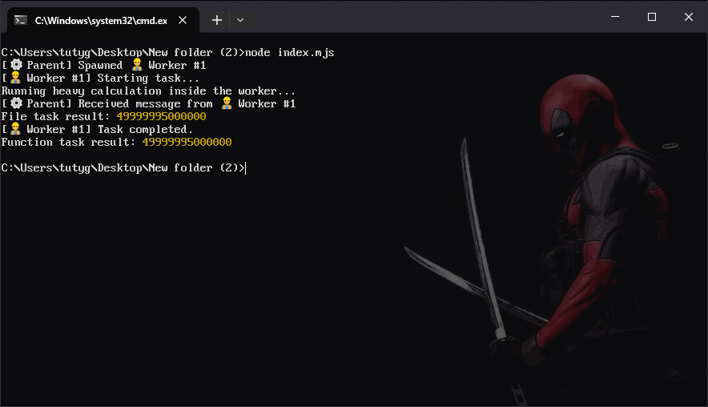

# easy-node-threading

<p align="center"><a href="https://nodei.co/npm/easy-node-threading/"></a></a></p>
<p align="center">
  
</p>

<p align="center">
  
</p>

* ⚡ Run JavaScript functions or files in isolated Node.js worker threads with a single call. Simple, minimal, and modern.
* ♻️ Works seamlessly with `CommonJS`, `ESM` and `TypeScript`

# 🤔 Why `easy-node-threading` is great

- **Zero boilerplate:** Run any function or file in a worker thread with a single call. No manual `Worker` setup needed.
- **Isolated execution:** Heavy computations run in a separate thread, keeping your main Node.js event loop fast and responsive.
- **Flexible & modern:** Supports both function references and file paths, `ESM` or `CJS`, and optional logging.
- **Full Node.js WorkerOptions support:** You can pass resource limits, `execArgv`, `env`, `stdio` and everything Node’s worker API allows.
- **Lightweight & minimal:** Tiny wrapper, no unnecessary dependencies.

# 📦 Install via [NPM](https://www.npmjs.com/package/easy-node-threading)

```bash
$ npm i easy-node-threading
```

# 💻 Usage

- See examples below for each scenario!
- For `workerOptions` object param, please see the list of available options here ➡ 🔗 https://nodejs.org/api/worker_threads.html#new-workerfilename-options

## CommonJS

### Task file example
```javascript
// task.js (CommonJS)
module.exports = async () => {
    console.log('Running heavy calculation inside the worker...');

    let sum = 0;
    for (let i = 0; i < 1e7; i++) {
        sum += i;
    }

    return sum;
};
```

### How to use in CommonJS
```javascript
const easyNodeThreading = require('easy-node-threading');

(async () => {
    const result = await easyNodeThreading(
        './task.js',                                // --| File to run
        {
            // --| workerOptions here
            resourceLimits: {
                maxOldGenerationSizeMb: 64,         // --| Limit memory usage
                codeRangeSizeMb: 4
            },
            execArgv: ['--trace-warnings'],         // --| Node.js flags for worker
            env: { NODE_ENV: 'worker' }             // --| Set environment
        },
        true                                        // --| Show logs
    );

    console.log('File task result:', result);

    // --| Or use a function directly from here, rather than an external file
    const resultFromFunction = await easyNodeThreading(taskFunction, {}, false);
    console.log("Function task result:", resultFromFunction);
})();

const taskFunction = () => {
    let sum = 0;
    for (let i = 0; i < 1e7; i++) {
        sum += i;
    }

    return sum;
};
```

## ESM

### Task file example
```javascript
// --| task.mjs (ESM)
export default async () => {
    console.log("Running heavy calculation inside the worker...");

    let sum = 0;
    for (let i = 0; i < 1e7; i++) {
        sum += i;
    }

    return sum;
};
```

### How to use in ESM
```javascript
import easyNodeThreading from "easy-node-threading";

(async () => {
    const result = await easyNodeThreading(
        './task.mjs',                               // --| File to run
        {
            // --| workerOptions here
            resourceLimits: {
                maxOldGenerationSizeMb: 64,         // --| Limit memory usage
                codeRangeSizeMb: 4
            },
            execArgv: ['--trace-warnings'],         // --| Node.js flags for worker
            env: { NODE_ENV: 'worker' }             // --| Set environment
        },
        true                                        // --| Show logs
    );

    console.log('File task result:', result);

    // --| Or use a function directly from here, rather than an external file
    const resultFromFunction = await easyNodeThreading(taskFunction, {}, false);
    console.log('Function task result:', resultFromFunction);
})();

const taskFunction = () => {
    let sum = 0;
    for (let i = 0; i < 1e7; i++) {
        sum += i;
    }

    return sum;
};
```

## TypeScript

### Task file example - Note we are using the same ".mjs" extension to avoid complications
```javascript
// --| task.mjs (ESM)
export default async () => {
    console.log("Running heavy calculation inside the worker...");

    let sum = 0;
    for (let i = 0; i < 1e7; i++) {
        sum += i;
    }

    return sum;
};
```

### How to use in TypeScript
```javascript
import easyNodeThreading from "easy-node-threading";

const taskFunction = (): number => {
    let sum = 0;
    for (let i = 0; i < 1e7; i++) {
        sum += i;
    }

    return sum;
};

(async () => {
    const result = await easyNodeThreading(
        './task.mjs',                               // --| File to run (NOTICE WE RUNNING A .mjs EXTENSION!)
        {
            // --| workerOptions here
            resourceLimits: {
                maxOldGenerationSizeMb: 64,         // --| Limit memory usage
                codeRangeSizeMb: 4
            },
            execArgv: ['--trace-warnings'],         // --| Node.js flags for worker
            env: { NODE_ENV: 'worker' }             // --| Set environment
        },
        true                                        // --| Show logs
    );

    console.log("File task result:", result);

    // --| Or use a function directly from here, rather than an external file
    const resultFromFunction = await easyNodeThreading(taskFunction, {}, false);
    console.log('Function task result:', resultFromFunction);
})();
```

## Run multiple workers in parallel. This example can be used in CommonJS, ESM and TypeScript
```javascript
// --| Example function tasks
const task1 = () => {
    let sum = 0;
    for (let i = 0; i < 1e7; i++) {
        sum += i;
    }

    return `Task1 result: ${sum}`;
};

const task2 = () => {
    let product = 1;
    for (let i = 1; i <= 10; i++) {
        product *= i;
    }

    return `Task2 result: ${product}`;
};

const task3 = () => {
    return `Task3 message at ${new Date().toISOString()}`;
};

(async () => {
    // --| Start 3 workers in parallel
    const workers = [
        easyNodeThreading(task1, {}, true),
        easyNodeThreading(task2, {}, true),
        easyNodeThreading(task3, {}, true)
    ];

    // --| Wait for all workers to complete
    const results = await Promise.all(workers);

    console.log("All worker results:");
    results.forEach(result => console.log(result));
})();
```
